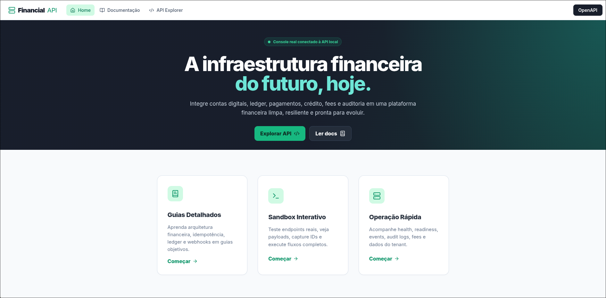
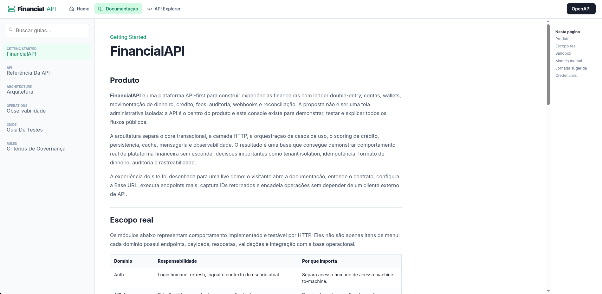
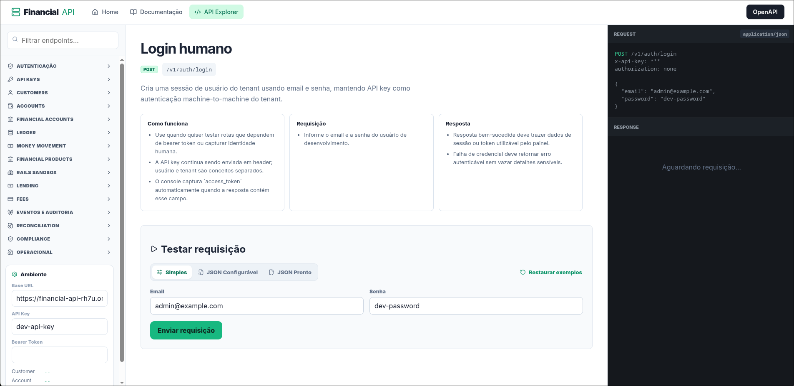

# FinancialAPI


**Multi-tenant fintech API for ledger, wallets, money movement, lending, webhooks, reconciliation and financial operations.**

[](https://thiagodifariafinancialapi.netlify.app/)
[](https://financial-api-rh7u.onrender.com/openapi.json)
[](https://www.typescriptlang.org/)
[](https://www.python.org/)
[](https://react.dev/)
[](https://www.postgresql.org/)
[](https://redis.io/)
[](LICENSE)

---

## Documentation / Documentacao

**Leia em Portugues:** [README_PT.md](README_PT.md)  
**Read the detailed English README:** [README_EN.md](README_EN.md)  
**API Reference:** [docs/API.md](docs/API.md)  
**Architecture:** [docs/ARCHITECTURE.md](docs/ARCHITECTURE.md)  
**Observability:** [docs/OBSERVABILITY.md](docs/OBSERVABILITY.md)  
**Local Guide:** [docs/GUIDE.md](docs/GUIDE.md)

---

## Live Demo

**Application:** [https://thiagodifariafinancialapi.netlify.app/](https://thiagodifariafinancialapi.netlify.app/)  
**Backend health:** [https://financial-api-rh7u.onrender.com/health](https://financial-api-rh7u.onrender.com/health)  
**OpenAPI JSON:** [https://financial-api-rh7u.onrender.com/openapi.json](https://financial-api-rh7u.onrender.com/openapi.json)

Development credentials available in the public demo:

```text
x-api-key: dev-api-key
email: admin@example.com
password: dev-password
```

The hosted frontend is a technical console for documentation, operations and real endpoint testing. The hosted backend runs the API and can wake up slowly on free infrastructure.

---

## Visual Preview

### Home



### Documentation



### API Explorer



---

## What is FinancialAPI?

FinancialAPI is a backend-first fintech platform that exposes a versioned HTTP API under `/v1`, a Python gRPC credit scoring service, PostgreSQL ledger storage, Redis idempotency, RabbitMQ outbox events, Prometheus/Grafana observability and a dedicated React client web.

The project is intentionally scoped as a general fintech/financial API foundation. It covers customer records, tenant API keys, human auth, financial accounts, ledger accounts, balances, holds, double-entry transactions, transfers, deposits, withdrawals, payments, lending, fees, webhooks, reconciliation, compliance-oriented operations and sandbox rails.

The sandbox rails for Pix, Boleto and Card Issuing are deterministic development helpers. They exercise ledger, audit, webhook, reconciliation and developer flows without pretending to be real provider integrations.

---

## Highlights

- Real HTTP API surface with OpenAPI 3.1 documentation.
- Multi-tenant access through API keys and request context.
- Human auth with login, refresh, logout and `/me`.
- UUIDv7 identifiers for newly created entities.
- Money represented as integer minor units and handled as `bigint` in the TypeScript domain.
- Double-entry ledger with transactions, entries and reversals.
- Redis-backed idempotency for sensitive financial commands.
- PostgreSQL migrations, RLS posture and transactional repositories.
- RabbitMQ/outbox event pipeline and persisted webhook deliveries.
- Python gRPC scoring service with deterministic policy behavior.
- Prometheus metrics, Grafana dashboards and tracing hooks.
- React/Vite client web with docs, operations and one-click endpoint tests.

---

## Main Modules

| Module | What it owns |
|--------|--------------|
| Auth and tenant access | API keys, tenant resolution, human login, sessions and refresh/logout |
| Customers | Individuals/businesses, status transitions, consents, export and anonymization |
| Accounts | Ledger accounts, financial accounts, balances, holds, limits and statements |
| Ledger | Double-entry transactions, entries, reversals and minor-unit money handling |
| Money movement | Transfers, deposits, withdrawals, payments, refunds and inbound/outbound flows |
| Lending | Products, simulations, applications, offers, contracts, installments and scoring |
| Sandbox rails | Pix keys/charges, Boleto issuance and card issuing simulation helpers |
| Fees and pricing | Fee schedules, pricing rules, fee charges and fee reversals |
| Webhooks/events | Event listing, endpoint registration, delivery persistence, retry and signing |
| Reconciliation | Reconciliation runs, items, ledger balance reports and outbox reports |
| Compliance | Customer export, anonymization and data retention policies |
| Developer platform | OpenAPI, client web, SDK examples and local operational scripts |

---

## Quick Start

```bash
cd infra
docker compose up --build -d
```

Useful local URLs:

| Surface | URL |
|---------|-----|
| Core API | `http://localhost:5000/v1` |
| OpenAPI | `http://localhost:5000/openapi.json` |
| Health | `http://localhost:5000/health` |
| Readiness | `http://localhost:5000/ready` |
| Metrics | `http://localhost:5000/metrics` |
| Client Web | `http://localhost:5173` |
| Prometheus | `http://localhost:9090` |
| Grafana | `http://localhost:3000` |
| Jaeger | `http://localhost:16686` |
| RabbitMQ UI | `http://localhost:15672` |

---

## Validation

Core API:

```bash
cd service-api/service-typescript
npm run typecheck
npm test
npm run build
npm run format:check
```

Client web:

```bash
cd client-web
npm run typecheck
npm run build
```

Python scoring:

```bash
cd service-api/service-python
../../.venv/bin/python -m ruff check .
../../.venv/bin/python -m mypy src tests
../../.venv/bin/python -m pytest
../../.venv/bin/python scripts/check_grpc_generated.py
```

Repository checks:

```bash
./scripts/sql-lint.sh
./scripts/secret-scan.sh
cd infra && docker compose config
```

---

## Contact

**Thiago DI Faria** - thiagodifaria@gmail.com

[](https://github.com/thiagodifaria)
[](https://linkedin.com/in/thiagodifaria)

---

## License

Licensed under the [MIT License](LICENSE).
